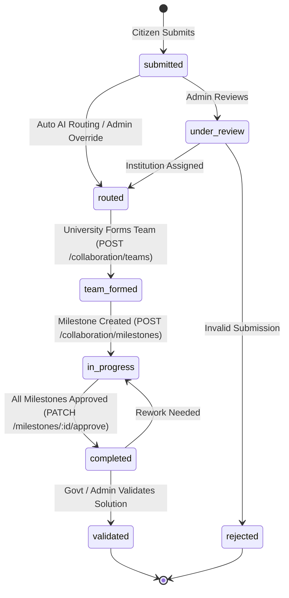

# Frontend API Integration Guide

> **Societal Innovation Collaboration Portal - Jharkhand**  
> Complete frontend developer integration reference, client setup, authentication flows, error handling patterns, real-time WebSocket subscriptions, and role access matrix.

---

## 📑 Table of Contents
1. [Architecture & Base URLs](#1-architecture--base-urls)
2. [Uniform API Envelope Standard](#2-uniform-api-envelope-standard)
3. [Authentication & Session Lifecycle](#3-authentication--session-lifecycle)
4. [Role-Based Access Control (RBAC) Matrix](#4-role-based-access-control-rbac-matrix)
5. [Real-time Push Notifications (WebSockets)](#5-real-time-push-notifications-websockets)
6. [Media Uploads & Storage](#6-media-uploads--storage)
7. [Frontend HTTP Client Setup (Axios & Fetch)](#7-frontend-http-client-setup-axios--fetch)
8. [Challenge State Machine Transitions](#8-challenge-state-machine-transitions)
9. [Related Documentation Links](#9-related-documentation-links)

---

## 1. Architecture & Base URLs

- **API Base URL**: `http://localhost:3000/api/v1` (Production: `https://your-domain.com/api/v1`)
- **OpenAPI Swagger Interactive UI**: `http://localhost:3000/api/docs`
- **Supabase Realtime WebSocket URL**: `https://<YOUR-PROJECT-REF>.supabase.co/realtime/v1/websocket`
- **Protocol**: REST over HTTPS / JSON (Multipart for media upload)

---

## 2. Uniform API Envelope Standard

All responses from the backend conform to a standardized JSON envelope structure.

### 2.1 Standard Success Envelope
```json
{
  "statusCode": 200,
  "data": { ... },
  "timestamp": "2026-08-29T11:45:00.000Z"
}
```

### 2.2 Paginated Success Envelope (`GET /challenges`)
```json
{
  "statusCode": 200,
  "data": [ ... ],
  "meta": {
    "total": 45,
    "page": 1,
    "limit": 10,
    "totalPages": 5
  },
  "timestamp": "2026-08-29T11:45:00.000Z"
}
```

### 2.3 Error Envelope
```json
{
  "statusCode": 400,
  "message": "Validation failed: title must be a string",
  "errorCode": "BAD_REQUEST",
  "timestamp": "2026-08-29T11:45:00.000Z"
}
```

### Error Code Reference
| HTTP Status | Error Code | Description |
|---|---|---|
| 400 | `BAD_REQUEST` | Validation error, malformed UUID, or bad input |
| 400 | `AUTH_SIGNUP_FAILED` | Supabase auth signup rejected (e.g. existing email) |
| 400 | `INVALID_STATE_TRANSITION` | Attempted illegal lifecycle transition |
| 401 | `UNAUTHORIZED` / `INVALID_CREDENTIALS` | Missing or invalid Bearer JWT token |
| 403 | `FORBIDDEN` / `FORBIDDEN_ACTION` | User role lacks permissions for the endpoint |
| 404 | `NOT_FOUND` / `CHALLENGE_NOT_FOUND` | Requested entity ID does not exist |
| 500 | `INTERNAL_SERVER_ERROR` | Unexpected backend or database failure |

---

## 3. Authentication & Session Lifecycle

The platform uses **Supabase Auth JWT tokens** passed via the `Authorization` header.

### 3.1 Header Format
```http
Authorization: Bearer <access_token>
```

### 3.2 Token Flow
1. **Signup (`POST /auth/signup`)**:
   - Registers user in Supabase Auth & creates record in `public.users`.
   - Citizens are `verified: true` automatically.
   - Institutional users (University, Industry, Govt) have `verified: false` until verified by Super Admin / Govt.
   - Returns initial `user` profile and `session` tokens.
2. **Login (`POST /auth/login`)**:
   - Validates email/password against Supabase Auth.
   - Returns `access_token`, `refresh_token`, `expires_at`, and full user profile.
3. **Session Persistence**:
   - Store `access_token` and `refresh_token` in `localStorage` or secure `httpOnly` cookies.
   - Attach token to all requests via an Axios / Fetch interceptor.

---

## 4. Role-Based Access Control (RBAC) Matrix

| User Role | Slug | Key Capabilities |
|---|---|---|
| **Citizen** | `citizen` | Submit challenges, upload photos/docs, view & update own challenges, view public analytics. |
| **PRI / ULB Official** | `pri_ulb_official` | View and endorse challenges in their district, view local users. |
| **University Admin** | `university_admin` | View routed challenges, form project teams, assign faculty/students, manage milestones. |
| **Faculty** | `faculty` | Lead project teams, create milestones, submit deliverables. |
| **Student** | `student` | Work on assigned project teams, submit milestone deliverables. |
| **Industry Partner** | `industry_partner` | View routed/in-progress challenges, submit CSR/R&D funding or resource proposals. |
| **Govt Viewer** | `govt_viewer` | State-wide analytics, view all challenges & teams, verify institutions, override AI routing. |
| **Super Admin** | `super_admin` | Full system access, state transitions, user verification, manual overrides, institution management. |

---

## 5. Real-time Push Notifications (WebSockets)

Frontend clients can subscribe to live challenge updates and user notifications using the `@supabase/supabase-js` client.

### 5.1 Listening for In-App Notifications
```typescript
import { createClient } from '@supabase/supabase-js';

const supabase = createClient(
  process.env.NEXT_PUBLIC_SUPABASE_URL!,
  process.env.NEXT_PUBLIC_SUPABASE_ANON_KEY!
);

export function subscribeToUserNotifications(userId: string, onNotification: (payload: any) => void) {
  const channel = supabase
    .channel(`user-notifications:${userId}`)
    .on(
      'postgres_changes',
      {
        event: 'INSERT',
        schema: 'public',
        table: 'notifications',
        filter: `recipient_id=eq.${userId}`,
      },
      (payload) => {
        console.log('New notification received:', payload.new);
        onNotification(payload.new);
      }
    )
    .subscribe();

  return () => {
    supabase.removeChannel(channel);
  };
}
```

### 5.2 Listening for Live Challenge Status Changes
```typescript
export function subscribeToChallengeUpdates(challengeId: string, onUpdate: (challenge: any) => void) {
  const channel = supabase
    .channel(`challenge:${challengeId}`)
    .on(
      'postgres_changes',
      {
        event: 'UPDATE',
        schema: 'public',
        table: 'challenges',
        filter: `id=eq.${challengeId}`,
      },
      (payload) => {
        console.log('Challenge updated:', payload.new);
        onUpdate(payload.new);
      }
    )
    .subscribe();

  return () => {
    supabase.removeChannel(channel);
  };
}
```

---

## 6. Media Uploads & Storage

### 6.1 Uploading directly during Challenge Submission
Use `multipart/form-data` with key `file` in `POST /challenges`:
```typescript
const formData = new FormData();
formData.append('title', 'Contaminated Tube Well');
formData.append('description', 'High iron and arsenic levels reported in village handpump.');
formData.append('district', 'Dumka');
formData.append('location_text', 'Ward 4, Kathikund');
formData.append('latitude', '24.2694');
formData.append('longitude', '87.2476');
if (selectedFile) {
  formData.append('file', selectedFile);
}

const response = await apiClient.post('/challenges', formData, {
  headers: { 'Content-Type': 'multipart/form-data' },
});
```

---

## 7. Frontend HTTP Client Setup (Axios & Fetch)

### Axios Setup with Bearer Token Interceptor
```typescript
import axios from 'axios';

export const apiClient = axios.create({
  baseURL: process.env.NEXT_PUBLIC_API_URL || 'http://localhost:3000/api/v1',
  headers: {
    'Content-Type': 'application/json',
  },
});

// Request Interceptor: Attach Supabase JWT Token
apiClient.interceptors.request.use((config) => {
  const token = localStorage.getItem('access_token');
  if (token) {
    config.headers.Authorization = `Bearer ${token}`;
  }
  return config;
});

// Response Interceptor: Unwrap data & standard error extraction
apiClient.interceptors.response.use(
  (response) => response.data,
  (error) => {
    const customError = error.response?.data || {
      statusCode: error.response?.status || 500,
      message: error.message || 'An unexpected error occurred',
      errorCode: 'UNKNOWN_ERROR',
    };
    return Promise.reject(customError);
  }
);
```

---

## 8. Challenge State Machine Transitions



### Valid Transition Matrix
| Current Status | Allowed Target Statuses | Allowed Roles |
|---|---|---|
| `submitted` | `under_review`, `routed`, `rejected` | `super_admin`, `govt_viewer`, `system` |
| `under_review` | `routed`, `rejected` | `super_admin`, `govt_viewer` |
| `routed` | `team_formed`, `under_review` | `university_admin`, `super_admin` |
| `team_formed` | `in_progress` | `university_admin`, `faculty`, `super_admin` |
| `in_progress` | `completed` | `super_admin`, `govt_viewer`, `university_admin` |
| `completed` | `validated`, `in_progress` | `super_admin`, `govt_viewer` |

---

## 9. Related Documentation Links
- [Complete API Endpoints Specification (API_ENDPOINTS.md)](./API_ENDPOINTS.md)
- [Page to API Route Mapping Guide (PAGE_API_MAPPING.md)](./PAGE_API_MAPPING.md)
- [Original Backend Contract (API_CONTRACT.md)](./API_CONTRACT.md)
