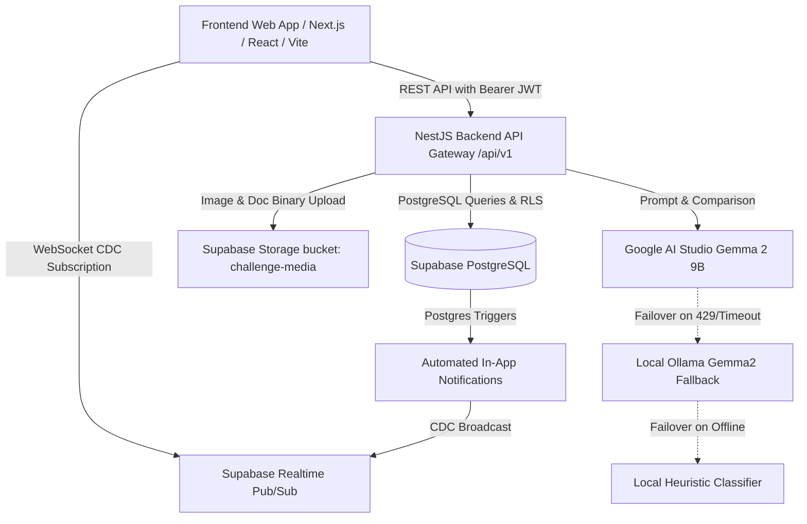
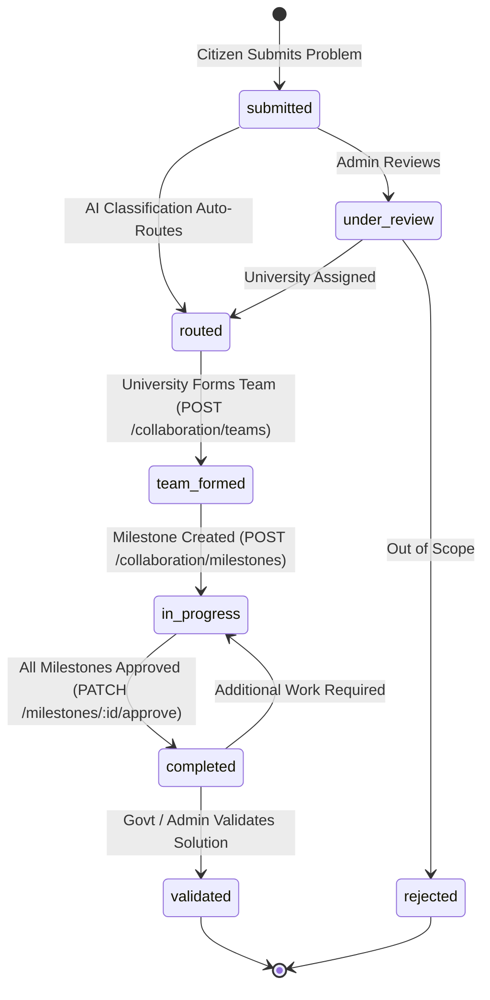

# Frontend Engineering Handoff Guide

> **Societal Innovation Collaboration Portal - Jharkhand (SIH)**  
> Complete self-contained engineering specification for frontend developers. Build the complete web application, dashboards, and role-based portals without reading the backend source code.

---

## 📑 Table of Contents
1. [Project Overview](#1-project-overview)
2. [Backend Architecture](#2-backend-architecture)
3. [Base URLs & Interactive Documentation](#3-base-urls--interactive-documentation)
4. [Frontend Environment Variables](#4-frontend-environment-variables)
5. [User Roles & Permissions Matrix](#5-user-roles--permissions-matrix)
6. [Authentication & Session Management](#6-authentication--session-management)
7. [Uniform API Envelopes & Error Handling](#7-uniform-api-envelopes--error-handling)
8. [Comprehensive Page Catalog & Feature Specs](#8-comprehensive-page-catalog--feature-specs)
9. [Page-to-API Mapping & Payload Reference](#9-page-to-api-mapping--payload-reference)
10. [Media & File Upload Flow](#10-media--file-upload-flow)
11. [Real-time Push Notifications & Live Events](#11-real-time-push-notifications--live-events)
12. [Challenge State Machine Lifecycle](#12-challenge-state-machine-lifecycle)
13. [Ready-to-Use Frontend Integration Code](#13-ready-to-use-frontend-integration-code)
14. [Deployment & Production Notes](#14-deployment--production-notes)

---

## 1. Project Overview

The **Societal Innovation Collaboration Portal** is a statewide platform for Jharkhand designed to crowdsource grassroots societal challenges from citizens and local governance bodies (PRI/ULB), classify and deduplicate them using **Google AI Studio Gemma models** (with offline Ollama fallback), and route them to university faculties, student engineering teams, and industry CSR partners for collaborative execution and verified resolution.

### Core Problems Solved:
- **Grassroots Sourcing**: Citizens and panchayat officials submit local problems (water contamination, road hazards, primary healthcare gaps, school electrification) with GPS coordinates and photos.
- **AI Triage & Deduplication**: High-speed AI categorizes issues into 10 domains, flags duplicates, assigns priority severity scores (1-100), and identifies matching university research labs.
- **Academic & Industry Execution**: Universities form student project teams, define milestone deliverables, and partner with industries (e.g. Tata Steel CSR, CCL) for funding and pilot testing.
- **Transparent Accountability**: Government authorities monitor district heatmaps, track resolution rates, and validate solutions upon completion.

---

## 2. Backend Architecture



- **Runtime**: Node.js v18+ / v20+ / v24+
- **API Framework**: NestJS with TypeScript
- **Database & Auth**: Supabase PostgreSQL with Granular Row-Level Security (RLS)
- **File Storage**: Supabase Storage (`challenge-media` public bucket)
- **AI Classification**: Google AI Studio Gemma API (`gemma-2-9b-it` / `gemini-1.5-flash`) + Local Ollama fallback
- **Realtime**: Supabase Postgres Change Data Capture (CDC) over WebSockets

---

## 3. Base URLs & Interactive Documentation

| Resource | URL | Description |
|---|---|---|
| **API Base URL** | `http://localhost:3000/api/v1` | All REST endpoints are prefixed with `/api/v1` |
| **Interactive Swagger UI** | `http://localhost:3000/api/docs` | Test endpoints, view DTO schemas, and try requests |
| **OpenAPI Raw JSON** | `http://localhost:3000/api/docs-json` | Machine-readable OpenAPI 3.0 schema |
| **Supabase Realtime WS** | `https://<YOUR-PROJECT-REF>.supabase.co/realtime/v1/websocket` | Realtime channel endpoint |

---

## 4. Frontend Environment Variables

Create a `.env.local` file in your frontend root:

```env
# Backend API URL
NEXT_PUBLIC_API_BASE_URL=http://localhost:3000/api/v1

# Supabase Client Credentials (for Auth persistence & Realtime WebSockets)
NEXT_PUBLIC_SUPABASE_URL=https://wwmskwauqxinghdwlwde.supabase.co
NEXT_PUBLIC_SUPABASE_ANON_KEY=eyJhbGciOiJIUzI1NiIsInR5cCI6IkpXVCJ9...

# Optional Mapbox / Leaflet Token (for Jharkhand GIS Heatmaps)
NEXT_PUBLIC_MAPBOX_TOKEN=pk.eyJ1Ijo...
```

---

## 5. User Roles & Permissions Matrix

The system enforces 8 distinct user roles across all portals:

| Role Identifier | Display Name | Permissions & Capabilities |
|---|---|---|
| `citizen` | **Citizen** | Submit challenges with photos/GPS, view own submissions, update while in `submitted` state, view public analytics. |
| `pri_ulb_official` | **Panchayat / ULB Official** | Submit local civic challenges, view all challenges and users in their assigned district. |
| `university_admin` | **University Admin / Dean** | View challenges routed to their university, create project teams, assign faculty/students, approve milestone completions, accept industry offers. |
| `faculty` | **Faculty Member** | Lead project teams, create milestones, review student deliverables, update progress. |
| `student` | **Student Contributor** | Work on assigned university project teams, submit milestone deliverables, code repositories, and reports. |
| `industry_partner` | **Industry / CSR Partner** | Browse routed & in-progress challenges, submit CSR funding / equipment / incubation proposals. |
| `govt_viewer` | **Government Authority** | State-wide analytics, district heatmaps, view all challenges/teams, verify institutional accounts, override AI routing, validate completed challenges. |
| `super_admin` | **Super Administrator** | Full platform control, override routing, manual state transitions, verify accounts, institutional management. |

---

## 6. Authentication & Session Management

### 6.1 Authentication Flow
1. **Registration (`POST /auth/signup`)**:
   - Creates a user in Supabase Auth and inserts their profile into `public.users`.
   - Citizens are automatically active (`verified: true`).
   - University Admins, Faculty, Students, and Industry Partners are registered with `verified: false` until verified by Super Admin / Govt.
2. **Login (`POST /auth/login`)**:
   - Validates email and password.
   - Returns user object and Supabase session tokens:
     - `access_token` (JWT string, valid for 1 hour)
     - `refresh_token` (Long-lived refresh token)
     - `expires_at` (Unix timestamp)
3. **Attaching the Token**:
   - Pass the JWT in the standard HTTP header:
     ```http
     Authorization: Bearer <access_token>
     ```

---

## 7. Uniform API Envelopes & Error Handling

Every backend response is wrapped in a consistent JSON structure.

### 7.1 Standard Success Envelope
```typescript
interface ApiResponse<T> {
  statusCode: number; // e.g. 200, 201
  data: T;
  timestamp: string;  // ISO 8601 string
}
```

### 7.2 Paginated Success Envelope (`GET /challenges`)
```typescript
interface PaginatedResponse<T> {
  statusCode: number;
  data: T[];
  meta: {
    total: number;
    page: number;
    limit: number;
    totalPages: number;
  };
  timestamp: string;
}
```

### 7.3 Error Envelope
```typescript
interface ApiErrorResponse {
  statusCode: number;
  message: string;
  errorCode: string;
  timestamp: string;
}
```

### 7.4 Standard Error Codes
| HTTP Status | Error Code | Description | UI Action |
|---|---|---|---|
| 400 | `BAD_REQUEST` | Validation error on form fields | Highlight offending inputs with error text |
| 400 | `AUTH_SIGNUP_FAILED` | User already exists or weak password | Show notification "Account with this email already exists" |
| 400 | `INVALID_STATE_TRANSITION` | Illegal status change attempt | Show alert "Invalid transition state" |
| 401 | `INVALID_CREDENTIALS` | Incorrect email or password | Show error on login form |
| 401 | `UNAUTHORIZED` | Token expired or missing | Clear local storage and redirect to `/login` |
| 403 | `FORBIDDEN` / `FORBIDDEN_ACTION` | Role not allowed | Show 403 Forbidden page or hide restricted buttons |
| 404 | `CHALLENGE_NOT_FOUND` | Invalid Challenge UUID | Redirect to 404 Not Found |

---

## 8. Comprehensive Page Catalog & Feature Specs

### Page 1: Public Landing & Discovery Page (`/`)
- **Target Audience**: All visitors & citizens
- **Features**:
  - **Live Impact Ticker**: Total challenges, resolved problems, active universities, student innovators (calls `GET /analytics/overview`).
  - **10 Core Category Badges**: Education, Agriculture, Healthcare, Water, Environment, Clean Energy, Urban Infrastructure, Accessibility, Public Administration, Rural Livelihoods (calls `GET /analytics/by-category`).
  - **Interactive District Heatmap**: Color-coded map of Jharkhand's 24 districts showing active vs resolved challenges (calls `GET /analytics/by-district`).
  - **Leaderboard**: Top contributing universities and CSR corporate partners (calls `GET /analytics/institutions`).
  - **CTA**: "Submit a Challenge" & "Explore Open Challenges".

### Page 2: Authentication Pages (`/login` & `/signup`)
- **Login (`/login`)**: Email & Password inputs, "Sign In" button, link to signup.
- **Signup (`/signup`)**:
  - **Step 1: Select Persona**: Citizen, Student, Faculty, University Admin, Industry Partner, PRI/ULB.
  - **Step 2: Profile Fields**: Full Name, Email, Password, Phone Number.
  - **Step 3: Role-Specific Details**:
    - If University / Faculty / Student: Select Institution (`org_id`).
    - If Citizen / PRI: Select District.

### Page 3: Citizen Dashboard & Submission (`/citizen`)
- **My Submissions Tab**: List of challenges submitted by the logged-in citizen with status badges (`submitted`, `routed`, `team_formed`, `in_progress`, `completed`).
- **Submit Problem Flow (`/citizen/new`)**:
  - Form Fields: Title, Detailed Problem Statement, District Dropdown (24 Jharkhand districts), Landmark/Village text, GPS Auto-Detect button (latitude/longitude), Photo/Document attachment.
  - Submitting sends `multipart/form-data` to `POST /challenges`.
  - Displays instant AI feedback with detected category, priority score, and assigned university lab.

### Page 4: PRI / ULB Governance Console (`/panchayat`)
- **District Challenge Inbox**: Filterable feed of societal problems in the official's district.
- **Verification & Endorsement**: Option to view local citizen submissions and track progress.

### Page 5: University Admin & Faculty Portal (`/university`)
- **Routed Challenges Queue**: Challenges assigned to the university by the AI engine.
- **Team Formation Modal**: Form a project team by selecting faculty leads and student contributors (calls `POST /collaboration/teams`).
- **Milestone Tracker (`/university/projects/:id`)**:
  - Create project milestones with deliverables and due dates (calls `POST /collaboration/milestones`).
  - Review submitted student reports and click "Approve" or "Reject" (calls `PATCH /collaboration/milestones/:id/approve`).
- **Industry Engagements Tab**: Review incoming CSR funding offers from companies like Tata Steel or CCL and click "Accept" (calls `PATCH /collaboration/engagements/:id/status`).

### Page 6: Student Innovation Workspace (`/student`)
- **My Projects**: Active projects where the student is assigned as a team contributor.
- **Deliverable Submission Drawer**: Upload project PDF reports, prototype video links, or GitHub repo URLs for faculty review (calls `PATCH /collaboration/milestones/:id/submit`).

### Page 7: Industry CSR Partner Portal (`/industry`)
- **Open Challenge Discovery**: Browse societal problems across Jharkhand eligible for CSR sponsorship.
- **Proposal Submission Modal**: Choose engagement type (`funding`, `mentorship`, `resources`, `pilot_testing`, `incubation`) and enter funding amount / proposal notes (calls `POST /collaboration/engagements`).

### Page 8: Government & Super Admin Console (`/admin`)
- **State-Wide KPI Overview**: Complete breakdown of status, categories, and district metrics.
- **Global Challenge Management**: View all challenges with search and status filtering.
- **AI Override Modal**: Manually override AI category, institution assignment, or priority score with reason logging (calls `POST /challenges/:id/override-routing`).
- **Institution Verification Console**: Verify newly registered universities and corporate accounts (calls `PATCH /users/:id/verify`).

---

## 9. Page-to-API Mapping & Payload Reference

### 9.1 Authentication Endpoints
```http
POST /api/v1/auth/signup
POST /api/v1/auth/login
```

#### Signup Request (`POST /api/v1/auth/signup`):
```json
{
  "email": "amit.verma@bitsindri.ac.in",
  "password": "SecurePassword123!",
  "name": "Prof. Amit Verma",
  "role": "faculty",
  "org_id": "a1000000-0000-0000-0000-000000000001",
  "district": "Dhanbad",
  "contact": "+91 9835000000"
}
```

#### Login Request (`POST /api/v1/auth/login`):
```json
{
  "email": "amit.verma@bitsindri.ac.in",
  "password": "SecurePassword123!"
}
```

#### Login Response:
```json
{
  "statusCode": 200,
  "data": {
    "user": {
      "id": "e7b0d2e8-4567-4a89-8012-9c8e7f123456",
      "email": "amit.verma@bitsindri.ac.in",
      "name": "Prof. Amit Verma",
      "role": "faculty",
      "org_id": "a1000000-0000-0000-0000-000000000001",
      "district": "Dhanbad",
      "verified": true
    },
    "session": {
      "access_token": "eyJhbGciOi...",
      "refresh_token": "v1.mc...",
      "expires_at": 1756473600
    }
  },
  "timestamp": "2026-08-29T11:45:00.000Z"
}
```

---

### 9.2 Challenges Endpoints
```http
POST  /api/v1/challenges
GET   /api/v1/challenges
GET   /api/v1/challenges/:id
POST  /api/v1/challenges/:id/override-routing
PATCH /api/v1/challenges/:id/status
```

#### Submit Challenge (`POST /api/v1/challenges`):
Send as `multipart/form-data` or `application/json`:
```json
{
  "title": "Arsenic Contamination in Drinking Well at Kathikund",
  "description": "Over 200 households in Kathikund block are facing severe skin lesions and gastrointestinal issues due to high arsenic concentrations in local handpumps.",
  "district": "Dumka",
  "location_text": "Village Kathikund, Near Panchayat Bhavan",
  "latitude": 24.2694,
  "longitude": 87.2476
}
```

#### Submit Challenge Response:
```json
{
  "statusCode": 201,
  "data": {
    "id": "b3e0d2e8-4567-4a89-8012-9c8e7f123456",
    "title": "Arsenic Contamination in Drinking Well at Kathikund",
    "district": "Dumka",
    "status": "routed",
    "priority_score": 85,
    "category_id": "c1000000-0000-0000-0000-000000000004",
    "assigned_institution_id": "a1000000-0000-0000-0000-000000000001",
    "ai_classification": {
      "categorySlug": "water",
      "categoryName": "Water & Sanitation",
      "priorityScore": 85,
      "recommendedKeywords": ["drinking water", "arsenic", "handpump"],
      "duplicateCandidateId": null,
      "duplicateSimilarityScore": 0.0,
      "rationale": "High priority drinking water contamination impacting tribal block.",
      "providerUsed": "GemmaAPI (Google AI Studio)",
      "processedAt": "2026-08-29T11:45:00.000Z"
    }
  },
  "timestamp": "2026-08-29T11:45:00.000Z"
}
```

#### List Challenges (`GET /api/v1/challenges`):
Query params: `?page=1&limit=10&status=routed&district=Dumka&search=arsenic`
```json
{
  "statusCode": 200,
  "data": [ ... ],
  "meta": {
    "total": 1,
    "page": 1,
    "limit": 10,
    "totalPages": 1
  },
  "timestamp": "2026-08-29T11:45:00.000Z"
}
```

#### Admin Override AI Routing (`POST /api/v1/challenges/:id/override-routing`):
```json
{
  "assigned_institution_id": "a1000000-0000-0000-0000-000000000003",
  "priority_score": 95,
  "override_reason": "Re-routed to NIT Jamshedpur due to water electrodialysis laboratory."
}
```

---

### 9.3 Collaboration & Team Endpoints
```http
POST  /api/v1/collaboration/teams
PATCH /api/v1/collaboration/teams/:id/members
GET   /api/v1/collaboration/teams/challenge/:challengeId
POST  /api/v1/collaboration/engagements
PATCH /api/v1/collaboration/engagements/:id/status
POST  /api/v1/collaboration/milestones
PATCH /api/v1/collaboration/milestones/:id/submit
PATCH /api/v1/collaboration/milestones/:id/approve
```

#### Form Team (`POST /api/v1/collaboration/teams`):
```json
{
  "challenge_id": "b3e0d2e8-4567-4a89-8012-9c8e7f123456",
  "university_id": "a1000000-0000-0000-0000-000000000001",
  "faculty_ids": ["e7b0d2e8-4567-4a89-8012-9c8e7f123456"],
  "student_ids": ["f8b0d2e8-4567-4a89-8012-9c8e7f123456"]
}
```

#### Create Milestone (`POST /api/v1/collaboration/milestones`):
```json
{
  "project_id": "d1e0d2e8-4567-4a89-8012-9c8e7f123456",
  "title": "Milestone 1: Water Sample Collection & Lab Chemical Analysis",
  "description": "Collect 50 groundwater samples across Dumka block.",
  "due_date": "2026-09-30T00:00:00.000Z"
}
```

#### Submit Milestone Deliverable (`PATCH /api/v1/collaboration/milestones/:id/submit`):
```json
{
  "deliverable_url": "https://wwmskwauqxinghdwlwde.supabase.co/storage/v1/object/public/challenge-media/dumka_water_report.pdf"
}
```

#### Approve Milestone (`PATCH /api/v1/collaboration/milestones/:id/approve`):
```json
{
  "approval_status": "approved",
  "approval_notes": "Water test results verified and accepted."
}
```

#### Submit Industry Proposal (`POST /api/v1/collaboration/engagements`):
```json
{
  "challenge_id": "b3e0d2e8-4567-4a89-8012-9c8e7f123456",
  "engagement_type": "funding",
  "proposal_notes": "Tata Steel CSR offering Rs 5 Lakhs grant for pilot water filtration units."
}
```

#### Accept Industry Proposal (`PATCH /api/v1/collaboration/engagements/:id/status`):
```json
{
  "status": "accepted"
}
```

---

### 9.4 Notifications & Users Endpoints
```http
GET   /api/v1/notifications
PATCH /api/v1/notifications/:id/read
PATCH /api/v1/notifications/read-all
GET   /api/v1/users/me
PATCH /api/v1/users/me
PATCH /api/v1/users/:id/verify
GET   /api/v1/users
```

---

### 9.5 Analytics Endpoints (Public)
```http
GET /api/v1/analytics/overview
GET /api/v1/analytics/by-category
GET /api/v1/analytics/by-district
GET /api/v1/analytics/institutions
```

---

## 10. Media & File Upload Flow

### Option A: Uploading During Challenge Creation (Recommended)
Attach the file directly to `POST /challenges` as `multipart/form-data`:
```typescript
const formData = new FormData();
formData.append('title', title);
formData.append('description', description);
formData.append('district', district);
if (file) {
  formData.append('file', file);
}

const response = await apiClient.post('/challenges', formData, {
  headers: { 'Content-Type': 'multipart/form-data' },
});
```

### Option B: Uploading Milestone Deliverables Directly via Supabase Storage
For large PDF reports, CAD models, and video deliverables:
```typescript
import { createClient } from '@supabase/supabase-js';

const supabase = createClient(
  process.env.NEXT_PUBLIC_SUPABASE_URL!,
  process.env.NEXT_PUBLIC_SUPABASE_ANON_KEY!
);

export async function uploadDeliverableFile(file: File) {
  const filePath = `deliverables/${Date.now()}_${file.name}`;
  const { data, error } = await supabase.storage
    .from('challenge-media')
    .upload(filePath, file, { upsert: true });

  if (error) throw error;

  const { data: publicUrlData } = supabase.storage
    .from('challenge-media')
    .getPublicUrl(filePath);

  return publicUrlData.publicUrl;
}
```

---

## 11. Real-time Push Notifications & Live Events

The backend automatically creates in-app notifications in PostgreSQL via database triggers when:
- A challenge is routed to an institution (`challenge_routed`).
- A challenge milestone is completed (`challenge_completed`).

### React Hook for Live Notifications
```typescript
import { useEffect, useState } from 'react';
import { createClient } from '@supabase/supabase-js';
import { apiClient } from './apiClient';

const supabase = createClient(
  process.env.NEXT_PUBLIC_SUPABASE_URL!,
  process.env.NEXT_PUBLIC_SUPABASE_ANON_KEY!
);

export function useNotifications(userId: string) {
  const [notifications, setNotifications] = useState<any[]>([]);

  useEffect(() => {
    if (!userId) return;

    // 1. Initial fetch
    apiClient.get('/notifications?unreadOnly=true').then((res) => {
      setNotifications(res.data || []);
    });

    // 2. Realtime WebSocket subscription
    const channel = supabase
      .channel(`user-notifications:${userId}`)
      .on(
        'postgres_changes',
        {
          event: 'INSERT',
          schema: 'public',
          table: 'notifications',
          filter: `recipient_id=eq.${userId}`,
        },
        (payload) => {
          setNotifications((prev) => [payload.new, ...prev]);
        }
      )
      .subscribe();

    return () => {
      supabase.removeChannel(channel);
    };
  }, [userId]);

  return notifications;
}
```

---

## 12. Challenge State Machine Lifecycle



---

## 13. Ready-to-Use Frontend Integration Code

### 13.1 Production Axios HTTP Client (`src/lib/api.ts`)
```typescript
import axios from 'axios';

export const api = axios.create({
  baseURL: process.env.NEXT_PUBLIC_API_BASE_URL || 'http://localhost:3000/api/v1',
  headers: {
    'Content-Type': 'application/json',
  },
});

// Attach Supabase Bearer JWT Token
api.interceptors.request.use((config) => {
  if (typeof window !== 'undefined') {
    const token = localStorage.getItem('supabase_access_token');
    if (token) {
      config.headers.Authorization = `Bearer ${token}`;
    }
  }
  return config;
});

// Unwrap standard response & extract error codes
api.interceptors.response.use(
  (response) => response.data,
  (error) => {
    if (error.response?.status === 401) {
      if (typeof window !== 'undefined') {
        localStorage.removeItem('supabase_access_token');
        window.location.href = '/login';
      }
    }
    const message = error.response?.data?.message || error.message || 'An error occurred';
    const errorCode = error.response?.data?.errorCode || 'UNKNOWN_ERROR';
    return Promise.reject({ message, errorCode, statusCode: error.response?.status || 500 });
  }
);
```

### 13.2 Authentication Context / State Provider (`src/context/AuthContext.tsx`)
```typescript
import React, { createContext, useContext, useState, useEffect } from 'react';
import { api } from '../lib/api';

interface User {
  id: string;
  name: string;
  email: string;
  role: string;
  org_id?: string;
  district?: string;
  verified: boolean;
}

interface AuthContextType {
  user: User | null;
  login: (credentials: any) => Promise<void>;
  logout: () => void;
  isLoading: boolean;
}

const AuthContext = createContext<AuthContextType>({} as AuthContextType);

export const AuthProvider: React.FC<{ children: React.ReactNode }> = ({ children }) => {
  const [user, setUser] = useState<User | null>(null);
  const [isLoading, setIsLoading] = useState(true);

  useEffect(() => {
    const token = localStorage.getItem('supabase_access_token');
    if (token) {
      api.get('/users/me')
        .then((res: any) => setUser(res.data))
        .catch(() => logout())
        .finally(() => setIsLoading(false));
    } else {
      setIsLoading(false);
    }
  }, []);

  const login = async (credentials: any) => {
    const res: any = await api.post('/auth/login', credentials);
    localStorage.setItem('supabase_access_token', res.data.session.access_token);
    setUser(res.data.user);
  };

  const logout = () => {
    localStorage.removeItem('supabase_access_token');
    setUser(null);
    window.location.href = '/login';
  };

  return (
    <AuthContext.Provider value={{ user, login, logout, isLoading }}>
      {children}
    </AuthContext.Provider>
  );
};

export const useAuth = () => useContext(AuthContext);
```

---

## 14. Deployment & Production Notes

1. **CORS Configuration**: The backend has CORS enabled with `origin: '*'` in development. In production, configure exact domain origins in `src/main.ts`.
2. **Supabase Inactivity (Free Tier)**: Free Supabase projects pause after 7 days without traffic. Set up a simple health check or cron pinging `GET /api/v1/analytics/overview` to keep the database warm.
3. **AI Fallback Assurance**: You do not need to build complex AI error retry logic on the frontend. If the Google AI Studio rate limit is reached, the backend handles failover transparently to Ollama or the local rule engine without failing the request.
4. **Interactive Swagger**: Frontend engineers can test live request payloads anytime at `http://localhost:3000/api/docs`.
